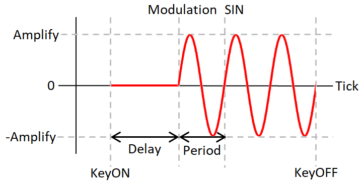
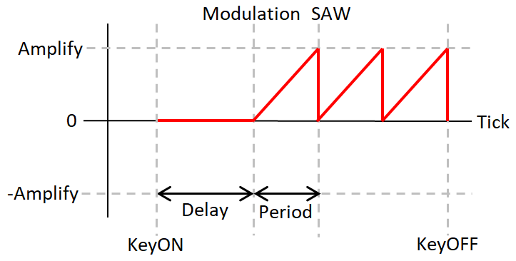
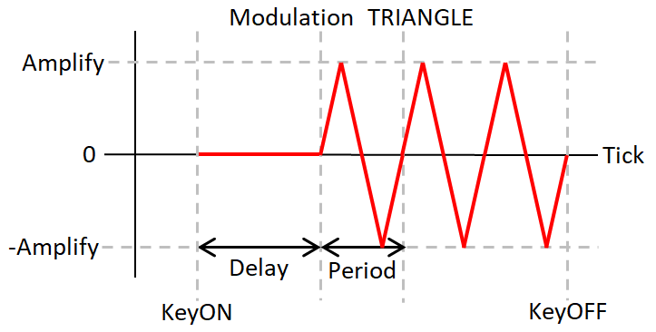
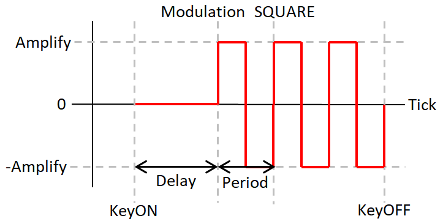
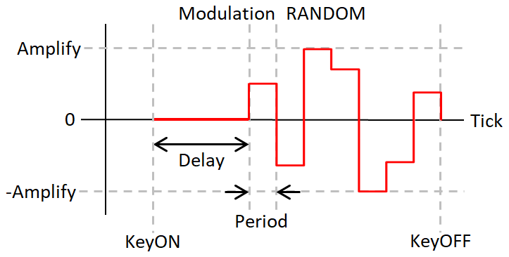
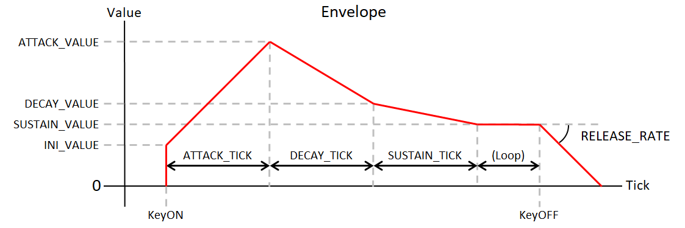

# PyMML - StandardMML (*Version 0*)
StandardMMLはPyMMLの標準的なMMLフォーマット。  
PyMMLの機能を使いやすいように設計されている。

<!--==============================================================================-->
## 目次
- [構造](#構造)
- [MMLフォーマット指定](#MMLフォーマット指定)
- [コメント](#コメント)
- [表記種別](#表記種別)
- [エントリ](#エントリ)
- [パート](#パート)
- [シーケンス](#シーケンス)
- [コントローラーについて](#コントローラーについて)

<!--==============================================================================-->
## 構造
テキストファイルの上から順に処理されていく。  
途中で#includeなどのエントリがある場合は対象ファイルに処理が移り、終了したら戻ってきて処理を再開する。  
基本的には、次のことをファイルの上から順に定義するとよい。

- MMLフォーマット指定
- システムの定義
- チップに合わせた初期化など
- 動作関係のエントリ
- タイトルなどのエントリ
- 音色定義
- コントローラーやマップの定義
- パート初期化
- シーケンス

<!--==============================================================================-->
## MMLフォーマット指定
MMLフォーマット指定はPyMMLとしての機能であり、StandardMMLの機能ではない。  
PyMMLはファイルの先頭256byteを読み込み、MMLフォーマット指定の文字列を探す。  
`@MML_TYPE`に続けて３個のパラメータを記述する。  
見つからない場合は `@MML_TYPE,standard,0,utf_8` として処理する。  
この文字列自体はMMLではないので、`コメントとして記述する`必要がある。
|パラメータ|表記種別|説明|
|-|-|-|
|MMLフォーマット|- standard<br>- bottom|今のところは2種。<br>bottomは手書きには不向き。|
|バージョン|INT|今のところは0のみ|
|エンコード|ID|utf_8が無難|
```
;@MML_TYPE,standard,0,utf_8
```

<!--==============================================================================-->
## コメント
表の上にあるものほど優先される。

|表記種別|説明|
|-|-|
|;;;;|;;;;からファイル終端までをコメントする|
|;;<～;;>|;;< から ;;>までをコメントする|
|"～"|"で囲われた部分をコメントとする|
|;|;から行末までをコメントとする|
```
/A @Bass v15 o3 l8 aaaaaagg ;行末までコメント aaaaaagg
/B @Piano v20 o4 l4 cdef"g;行末までコメントされない"ab>c1
```

<!--==============================================================================-->
## 表記種別
MML中で定義するエントリやコマンドではアルファベットや数字で値を記述する。  
項目によって記述できる文字や範囲が異なる。

|表記種別|文字|説明|
|-|-|-|
|ID|_ 0～9 a～z A～Z|定義を区別して指定するための名前。大文字と小文字を区別する。|
|ID_NUM|_ 0～9 a～z A～Z|定義を区別して指定するための名前。大文字と小文字を区別する。<br>DefNameModeがNumberの場合は0以上の10進数のみ、<br>Stringの場合はアルファベットも使用できる。|
|INT|_ + - 0～9|整数。2進数、16進数表記が可能。符号をつけられる|
|REAL|_ + - . 0～9|実数。符号をつけられる。10進数のみ|
|FLAG|0～1|0=OFF、1=ON|
|VV|~ ~~ * ** _ + - . 0～9|INT、~弱相対、~~強相対、*弱倍率、**強倍率が指定可能。<br>相対の場合はINT、倍率はREALで値を指定可能。|
|音長|+ - % _ . 0～9|音符の長さを指定する。<br>. は付点、%はTick指定、+-は音長の増減。|
|リスト|- value1<br>- value2<br>....|示された文字列のいずれかを指定する。<br>- は箇条書きの点なので記述しないこと|
|文字列|なんでも|日本語もスペースもOK。ただし、`コメントは機能する`ので注意|
|PATH| * , " ? < > 以外|OSのファイルシステムで使用できるパスの文字。<br>現在はWindowsのみなのでこのようになっている。|
|特殊||そのところの仕様による。|

数字の値ではアンダーバー_はどこにあっても無視されるため、桁の区切りなどとして使用可能。  
2進数表記は数字部分を大文字のIから始め、16進数表記は大文字のHから始める。
```
    v001    ; v1と同じ
    v1_0    ; v10と同じ
    vH1f    ; 16進数表記。v31と同じ
    vI10100 ; 2進数表記。v20と同じ
    v~-4    ; 弱相対を-4にする
    v~~-H1a ; 強相対を-26(16進数表記)にする
    v*2     ; 弱倍率を2.0にする
    v**1.5  ; 強倍率を1.5にする
    c+4.-%1 ; 付点4分音符から-1tickしたド#
```

<!--==============================================================================-->
## エントリ
PyMMLの動作にかかわるもの、曲のタイトルなどを定義する。

行頭の # に続けてエントリ名を記述する。  
エントリ名は大文字と小文字を区別しない。また、長いものと短いものがある。

エントリでのデータ定義では区切りは空白文字とする。  
基本的には１行で定義するが、データが複数行になる場合はブロック記述を使用する。  
ブロック記述が必須の項目もあるので、各エントリの仕様を確認すること。

データ定義で初期値の記載のあるものは定義しない場合の値であり、  
定義をするときに値の記述を省略することはでない。

|系統|||||||
|-|-|-|-|-|-|-|
|システム系|[#System](#システム定義)|[#Path](#検索パス)|[#Include](#インクルード)||||
|テキスト系|[#Title](#タイトル)|[#Composer](#作曲者)|[#Arranger](#編曲者)|[#Message](#メッセージ)||
|シーケンス系|[#WholeNoteTicks](#全音符のTick数)|[#OctaveUpDown](#オクターブ移動)|[#VolumeUpDown](#音量移動)|[#EnablePart](#パート定義)|||
|定義系|[#DefNameMode](#定義名モード)|[#ControllerData](#コントローラー定義)|[#ToneData](#音色定義)|[#MapperData](#マッパー定義)|[#Sequence](#シーケンス定義)|[#Macro](#マクロ定義)|
|その他|[#YMF825_ToneTable](YMF825トーンテーブル)||||||

------------------------------------------------------------------
### システム定義
**#System**  
**#sys**
|パラメータ|表記種別|説明|
|-|-|-|
|システム名|ID_NUM|sコマンドで指定する名前|
|デバイス種別|ID|デバイスの種類を表すID|
|デバイスID|ID|デバイス個別のID|
|ポートとチップのブロック|特殊|/ でポート定義を開始する。<br>ポート内に複数のチップを搭載できる場合はスペースで区切ってチップ種別を記述する。<br>実際に搭載されていなくてもなにかしらのチップ種別を記述しておく必要がある。<br>ポート数、チップ数はデバイス種別による。|
```
#System sys1 FT232H FTPVNW8R / YMF825
#sys {
    TestSys ; システム名
    MOCK4   ; デバイス種別
    1234    ; デバイスID
    / YMF825        ; sTestSys,0,0
    / YM2203 YM2608 ; sTestSys,1,0  sTestSys,1,1
    / YMF825        ; sTestSys,2,0
    / YMF825        ; sTestSys,3,0
}
```

------------------------------------------------------------------
### 検索パス
**#Path**
|パラメータ|表記種別|説明|
|-|-|-|
|パス|PATH|インクルードで検索するパスを定義する。<br>絶対パス、またはカレントフォルダからの相対パスを使用可能。<br>パスの区切りは / にすること。 /で終ること。<br>スペースが含まれる場合はブロック記述を使用すること。|
```
#Path C:/my_mml/
#path { C:/Program Files/app/ }
```

------------------------------------------------------------------
### インクルード
**#Include**  
**#inc**
|パラメータ|表記種別|説明|
|-|-|-|
|ファイル名|PATH|ファイルは検索パスから検索する。<br>絶対パス、またはカレントフォルダからの相対パスを使用可能。<br>パスの区切りは / にすること。<br>スペースが含まれる場合はブロック記述を使用すること。|
```
#include my_system.mml
#INC ./../test/test.mml
#Include { C:/Program Files/app/test.mml }
```

------------------------------------------------------------------
### タイトル
**#Title**  
**#tit**
|パラメータ|表記種別|説明|
|-|-|-|
|タイトル|文字列|曲のタイトルを定義する。|
```
#Title This is my song.
#tit 日本語も書けるよ
```

------------------------------------------------------------------
### 作曲者
**#Composer**  
**#com**
|パラメータ|表記種別|説明|
|-|-|-|
|作曲者|文字列|曲の作曲者を定義する。|
```
#Composer Dの人
#com person of D
```

------------------------------------------------------------------
### 編曲者
**#Arranger**  
**#arr**
|パラメータ|表記種別|説明|
|-|-|-|
|編曲者|文字列|曲の編曲者を定義する。|
```
#Arranger D-Types
#arr D型
```

------------------------------------------------------------------
### メッセージ
**#Message**  
**#msg**
|パラメータ|表記種別|説明|
|-|-|-|
|メッセージ|文字列|曲にメッセージを追加する。<br>複数定義で行が追加される。|
```
#Message その他の情報を表示する。
#msg ２行目です。
```

------------------------------------------------------------------
### 全音符のTick数
**#WholeNoteTicks**  
**#zen**
|パラメータ|表記種別|初期値|説明|
|-|-|-|-|
|全音符のTick数|INT|192|全音符のTick数を指定する。<br>音長指定時に割り切れないとエラーになるので注意。<br>小さくすると1tickあたりの時間が長くなりモタリにくくなるが、表現力が落ちる。|
```
#WholeNoteTicks 192
#zen 96 ; これくらいでも十分なきもする
```

------------------------------------------------------------------
### オクターブ移動の文字
**#OctaveUpDown**  
**#oct**
|パラメータ|表記種別|初期値|説明|
|-|-|-|-|
|オクターブ移動の文字|- > <<br>- < >|> <|左が上昇、右が下降になる。|
```
#OctaveUpDown > < ; 標準
#oct < > ; 逆
```

------------------------------------------------------------------
### 音量移動の文字
**#VolumeUpDown**  
**#vol**
|パラメータ|表記種別|初期値|説明|
|-|-|-|-|
|音量移動の文字|- ) (<br>- ( )|) (|左が上昇、右が下降になる。|
```
#VolumeUpDown ) ( ; 標準
#vol ( ) ; 逆
```

------------------------------------------------------------------
### パート定義
**#EnablePart**  
**#part**
|パラメータ|表記種別|説明|
|-|-|-|
|使用するパート|特殊|大文字のアルファベット1個26種類と数字1桁10種類の全260通りから必要なだけ定義可能。<br>アルファベットのみは数字0とみなされる。<br>同じアルファベットで数字を変更して定義する場合は数字の連続で定義可能(このとき0は必要)。<br>スペースを使用可能。<br>シーケンスを定義するパートについては詳しくは[パート](#パート)を参照。|
```
#EnablePart ABCD EFGH IJKL MNOP ; YMF825用16パート
/A
/B
....
/P

#Part A0123456789 ; A0～A9を定義
/A0
/A1
...
/A9 
```

------------------------------------------------------------------
### 定義名モード
**#DefNameMode**  
**#dnmode**
|パラメータ|表記種別|初期値|説明|
|-|-|-|-|
|定義名モード|- String<br>- Number|String|Stringの場合は定義名にアルファベットが使用可能<br>Numberの場合は10進数のみ|
```
#DefNameMode String ; IDにする
/A @pianocde  ; cdeも音色名に含まれる
   @piano cde ; スペースを入れること

#dnmode Number ; INTにする
/A @001cde ; cdeは音符になる
   @1 cde ; 上と同じ
```
`***モードがNumberのとき、Stringで定義されたデータを指定できなくなるので注意***`  
定義名モードに対応するエントリとコマンドは以下の通り
|エントリ|コマンド|パラメータ|
|-|-|-|
|#System|s|システム名|
|#ControllerData|*|コントローラー名|
|#Macro|!|マクロ名|
|#ToneData|@|音色名|
|#MapperData|`|マップ名|
|#Sequence|$|シーケンス名|

------------------------------------------------------------------
### コントローラー定義
**#ControllerData**  
**#ctrl**
|パラメータ|表記種別|説明|
|-|-|-|
|コントローラー名|ID_NUM|*コマンドで呼び出すときの名前|
|TYPE|- MODULATION<br>- SWEEP<br>- PORTAMENTO<br>- ENVELOPE<br>- RAW|コントローラー種別<br>MODULATION=ビブラート、トレモロ<br>SWEEP=ドラム、効果音<br>PORTAMENTO=表情付け<br>ENVELOPE=SSG,PCMの表情付け<br>RAW=SSG,PCMの表情付け|
|MODIFY_VALUE|- PITCH<br>- VOLUME<br>- PAN<br>- NOTE|変化させる対象<br>PITCH=音程(Dコマンドと同等)<br>VOLUME=音量(vコマンドと同等)<br>PAN=パン(pコマンドと同等)<br>NOTE=音階(nコマンドと同等)|
|MODIFY_TYPE|- CURRENT<br>- RELATIVE<br>- MULTIPLE|変化させる方法<br>CURRENT=コントローラーの値を現在値とする<br>RELATIVE=コントローラーの値を現在値に加算する<br>MULTIPLE=コントローラーの値を現在値に乗算する|
|個別パラメーター||下記参照|

#### MODULATIONの個別パラメータ
|パラメータ|単位|表記種別|範囲|説明|
|-|-|-|-|-|
|WAVE||- SIN<br>- SAW<br>- TRIANGLE<br>- SQUARE<br>- RANDOM||SIN=サイン波<br>SAW=のこぎり波<br>TRIANGLE=三角波<br>SQUARE=矩形波(デューティー比は50%固定)<br>RANDOM=乱数(period毎に変化)|
|DELAY|Tick|INT|0以上|変化が始まるまでの期間|
|AMPLIFY||REAL|0以上|振幅|
|PERIOD|Tick|INT|1以上|波形の1周期の期間|

#### SWEEPの個別パラメータ
|パラメータ|単位|表記種別|範囲|説明|
|-|-|-|-|-|
|VOLUME_INI||INT|0以上|最初の値|
|STEP|Tick|INT|1以上|変化する間隔|
|VOLUME||INT||一度に変化する量|

#### PORTAMENTOの個別パラメータ
|パラメータ|単位|表記種別|範囲|説明|
|-|-|-|-|-|
|TIME|Tick|INT|0以上|変化にかかる期間|
|CONTROL|Note|INT|-1以上|前回のNote。キーオン時に自動で更新される。<br>-1は前回のNoteが無い状態を表していて、<br>次のキーオンでは音程変化はない。さらに次のキーオンから機能する。|

#### ENVELOPEの個別パラメータ
|パラメータ|単位|表記種別|範囲|説明|
|-|-|-|-|-|
|INI_VALUE||REAL|0以上|動作開始した時の値|
|ATTACK_TICK|Tick|INT|0以上|AttackのTick数|
|ATTACK_VALUE||REAL|0以上|Attack完了時の値|
|DECAY_TICK|Tick|INT|0以上|DecayのTick数|
|DECAY_VALUE||REAL|0以上|Decay完了時の値|
|SUSTAIN_TICK|Tick|INT|0以上|SustainのTick数|
|SUSTAIN_VALUE||REAL|0以上|Sustain完了時の値|
|RELEASE_RATE||REAL|0以上|キーオフ時1tick毎に減衰する値|

#### RAWの個別パラメータ
RAWは1tick毎に値を直接指定する
- 1データは1Tickの長さ
- データはスペースで区切る
- L は Loop Point
- R は Release Point
- 動作開始すると定義順に出力する
- 動作している間に R に到達した場合は L に戻る
- キーオフすると R 以降を出力する
- 同じ値が連続する場合は`*`で数を指定可能（例 2 2 2 であれば `2*3` とする）
- 指定できる最小値と最大値は音源による
```
#ControllerData {
    RawTest  ; ID
    RAW      ; TYPE
    VOLUME   ; MODIFY_VALUE
    CURRENT  ; MODIFY_TYPE
    10 15 12 L 10 9 10 11 R 3*2 2*3 1*4
}
/A  C1
    *RawTest,1   ; コントローラーをONにする
    o4 l4 cdefg1 ;
    *RawTest,0   ; コントローラーをOFFにする
```

------------------------------------------------------------------
### 音色定義
**#ToneData**  
**#tone**
|パラメータ|表記種別|説明|
|-|-|-|
|チップ種別|ID|チップを指定する|
|音色名|ID_NUM|@コマンドで指定する名前|
|音色データ|INT|項目の数はチップ種別による|
```
#ToneData {
  YMF825 Piano
;ALG BO LFO
  3  1  1
;WS FB  AR  TL  DR  SL  SR  RR  MUL DT  EAM DAM EVB DVB KSR KSL XOF
  0  0  15  50   6   6   4   9   1   0   0   0   0   0   0   0   0 
  0  0  15  42   0   0   3   0   5   0   0   0   0   0   0   0   0 
  0  0  13  37   4   2   4   9   2   0   0   0   1   1   0   0   0 
  0  0  13   0   3   2   3  13   1   0   0   0   0   0   0   0   0 
}
```

------------------------------------------------------------------
### マッパー定義
**#MapperData**  
**#map**
|パラメータ|表記種別|説明|
|-|-|-|
|マップ名|ID_NUM|`コマンドで呼び出すときの名前|
|マップモード|- Mapper<br>- Drum|Mapper=キー範囲で音色切り替えなど。キーは変更なし。<br>Drum=キーで音色切り替えなど。入力キーから出力キーに変換される。|
|範囲開始オクターブ(Mapper)<br>入力オクターブ(Drum)|INT|0～9|
|範囲開始キー(Mapper)<br>入力キー(Drum)|特殊|c～b、臨時記号を使用可能|
|範囲終了オクターブ(Mapper)<br>出力オクターブ(Drum)|INT|0～9|
|範囲終了キー(Mapper)<br>出力キー(Drum)|特殊|c～b、臨時記号を使用可能|
|コマンド群|シーケンス|`ブロック記述が必須`。<br>キー定義に該当するキーオンがあった場合に発行されるコマンド群。<br>次のコマンドのみ使用可能 p q u v y D F ' @ \| * M E R S P|

キーとコマンド群は必ずセットで定義すること。  
チャンネル毎に１つのマッパーを使用可能。  
Mapperモードでは範囲に入るキーのKeyOnがあるとコマンド群が実行された後にKeyOnされる。  
Drumモードでは入力キーのKeyOnがあるとコマンド群が実行された後に出力キーでKeyOnされる。

```
#Map {
    my_drum_map ; ID
    Drum        ; mode
    2 c  2 c  { @6  v~-0  SE0        } ;BD
    2 d  3 c  { @7  v~-4  SE1 S-10,1 } ;SD
    2 e  2 b  { @8  v~-8  SE1 S-20,1 } ;Tom L
    2 f  3 f  { @8  v~-9  SE1 S-25,1 } ;Tom M
    2 g  3 a  { @8  v~-10 SE1 S-30,1 } ;Tom H
    3 c  6 f+ { @9  v~-10            } ;HH Close
    3 d  6 f+ { @10 v~-10            } ;HH Open
    3 e  6 f+ { @11 v~-12            } ;Cymbal
}
/ABC  `my_drum_map,1 l16
/A  C1 v30 o2 [3 crrr drrr crcr drrr] gggg ffff eeee dddd  r1
/B  C2 v20 o3 [3 rrcc rrcc rrcc rcd8] r1                   r1
/C  C3 v25 o3    c1 r1 c1             r1                   c1
```

------------------------------------------------------------------
### シーケンス定義
**#Sequence**  
**#seq**  
|パラメータ|表記種別|説明|
|-|-|-|
|シーケンス名|ID_NUM|$コマンドで呼び出すときの名前|
|シーケンスデータ|特殊|シーケンスと同じ。ただし、パート表記は使用できない。|
```
#Sequence pre1 cdeg>
#seq pre2 c<ged
#seq {
    pre_c ; シーケンス名
    $pre1 $pre1 $pre1 $pre1
    $pre2 $pre2 $pre2 $pre2
}
/A @harp v15 o3 $pre_c
```

------------------------------------------------------------------
### マクロ定義
**#Macro**  
**#mac**  
|パラメータ|表記種別|説明|
|-|-|-|
|マクロ名|ID_NUM|!コマンドで呼び出すときの名前|
|項目定義|特殊|下記参照|
|シーケンスデータ|シーケンス|!コマンドのある場所に展開するシーケンスデータ。<br>項目定義の項目名と同じ文字列を!コマンドのパラメータで指定された文字列に置き換える。<br>`ブロック記述が必須`。|

#### 項目定義
|パラメータ|表記種別|説明|
|-|-|-|
|項目名|ID|シーケンスデータ内で置き換えるときに使用する名前|
|項目型|- id<br>- int<br>- real<br>- flag|id=名前向け文字列(表記種別 ID)<br>int=整数(表記種別 INT)<br>real=実数(表記種別 REAL)<br>flag=フラグ(表記種別 FLAG)|
|デフォルト値||項目が省略されたときに使用される値。<br>項目型にあった値にすること。|
```
#Macro {
    WCR ; マクロ名
    _PARAM_   id    VoVol ; 項目名の_は他の文字列と一致しないようにつけている
    _VALUE_   int   0     ; 
    {
        uCHIP,WRITE_CONTROL_REGISTER,_PARAM_,_VALUE_
    }
}
/A C0 !WCR,VoVol,24 !WCR,DIR_CV,0 !WCR,XVB,1
```

------------------------------------------------------------------
### YMF825トーンテーブル
**#YMF825_ToneTable**  

YMF825に音色データを書き込むコマンドを生成する。
|パラメータ|表記種別|説明|
|-|-|-|
|音色名|ID_NUM|@コマンドで指定する名前<br>16個まで指定可能。|
```
#YMF825_ToneTable {
    Bass      ;  0
    Pipe      ;  1
    StringHi  ;  2
    Piano     ;  3
    EPiano    ;  4
    Hosoi     ;  5
    Ensemble  ;  6
    Horn      ;  7
    Glocken   ;  8
    BD        ;  9
    SD        ; 10
    HH_close  ; 11
    HH_open   ; 12
    Cymbal1   ; 13
    Cymbal2   ; 14
    Windchime ; 15
}
/A @Pipe v25 o4 l8 cdef g2
```

<!--==============================================================================-->
## パート
### 指定方法
大文字アルファベット1個26種類、数字1桁10種類、ORIGIN、全261通りのパートがある。  
`パートとチャンネルは紐づいていない`。チャンネルはCコマンドで指定する。

`#EnablePart で定義されたパートが使用可能`になり、  
`行頭の/` に続けてパート名を連続で記述する。
```
#EnablePart A0 A1 A2 B0 B1 C0 C1 ; 例

/A0 v20 ;v20は仮のコマンド
/A v20  ;数字の0は省略可能
/D v20  ;#EnablePartに定義がないのでエラーになる
```
連続したパートは同じシーケンスデータになる。  
```
/A1B1C1 v20 ;まとめて書いた
/A1 v20 ;バラで書いた
/B1 v20
/C1 v20

/A0A1A2 v20 ;アルファベットが同じ場合は省略可能。
/A012   v20 ;このときは0を記述すること
```
新たなパートを指定するまでは、最後に指定したパートが有効になる。  
インデントは必ずしも必要ではないが、つけておけばテキストエディタの機能で折りたためる。
```
/A  v20          ;ここはA
    @Piano       ;ここもA
    o4 l8 cdefg2 ;ここもA
/B  v20          ;ここからB
```
`行頭でない/は行頭パートの一部を指定可能`。  
行頭でない/にパートを指定しない場合は、行頭パートを全て指定したものとする。
```
/AB
    @Pipe v18 l8 /B v~-10 r16 ;Bをディレイにする
    /  cde4 efg4 ; ここからAB
    /C v20 ;行頭の指定にCが含まれないためエラーになる
```

### ORIGIN
ORIGINは特別なパートで、表記は _  
#EnablePartの定義にかかわらず、必ず存在する。  
MMLファイルの先頭は ORIGINパートと認識される。  

チップの初期化、その他のパートをキックしたり、テンポなど、  
曲全体にかかわるものを記述することを想定している。  
チャンネルを指定して音符を置くことも可能だが、推奨しない。

行頭でのみ指定可能。また、ほかのパートと同時には指定できない。  
```
;実はここもORIGIN
/_ t120 K{-b} ;ここはORIGIN
/_A ;ORIGINだけでないのでエラーになる
/_
    /_   ;行頭でないORIGINはエラー
```

<!--==============================================================================-->
## シーケンス
パートにコマンドを並べて曲を組み立てる部分。
- コマンドは記号やアルファベット１文字または２文字で記述する
- コマンドの大文字と小文字は区別される
- パラメータはコマンドに続けて記述する
- パラメータが複数ある場合はカンマで区切ってつなげて記述する
- パラメータが省略ができるものは`省略時の値`が表に書いてある
- 音符、調号、局所ポルタメントは特別な書き方になっているので注意

|系統|||||||
|-|-|-|-|-|-|-|
|システム系|[s システム](#システム)|[u ユニーク](#ユニーク)|
|音楽系|[t テンポ](#テンポ)|[K 調号](#調号)|[A チューニング](#チューニング)|[B 小節Tick数](#小節Tick数)|
|チャンネル系|[C チャンネル](#チャンネル)|[@ 音色](#音色)|[v 音量](#音量)|[)( 音量移動](#音量移動)|[D デチューン](#デチューン)|[p パン](#パン)|
|音符系|[cdefgab 音符](#音符)|[r 休符](#休符)|[o オクターブ](#オクターブ)|[>< オクターブ移動](#オクターブ移動)|
||[l 省略音長](#省略音長)|[^ 音長追加](#音長追加)|[& タイ](#タイ)|[&& スラー](#スラー)|[q クオンタイズ](#クオンタイズ)|
||[x 音階なし音符](#音階なし音符)|[n ノートナンバー](#ノートナンバー)|[k キーオンオフ](#キーオンオフ)|[{ } 局所ポルタメント](#局所ポルタメント)|
|シーケンス系|[[ : ] ループ](#ループ)|[L 無限ループ](#無限ループ)|[$ シーケンス呼出](#シーケンス呼出)|
|コントローラー系|[M モジュレーション](#モジュレーション)|[S スイープ](#スイープ])|[P ポルタメント](#ポルタメント)|[E エンベロープ](#エンベロープ)|[R RAW](#RAW)|[* コントローラー](#コントローラー)|
|レジスタ系|[y レジスタ](#レジスタ)|[' パラメータ](#パラメータ)|[F FMオペレータ](#FMオペレータ)|
|その他|[\| 機能なし](#機能なし)|[` マッパー](#マッパー)|[! マクロ](#マクロ)|[W ウェイト](#ウェイト)|
|デバッグ|[m ミュート](#ミュート)|[? デバッグ](#デバッグ)|

------------------------------------------------------------------
### システム
**s** (小文字)  
#Systemで定義したデバイスのポート番号とチップ番号を指定し、パートの出力先を指定する。  
実際に音を出すには、チャンネルコマンドも必要。
|パラメータ|表記種別|説明|
|-|-|-|
|システム名|ID_NUM|#Systemで定義したシステム名|
|ポート番号|INT|#Systemで定義したシステムのポート番号。0始まり|
|チップ番号|INT|#Systemで定義したシステムのチップ番号。0始まり|
```
/A sC86Box,1,0 ; C86Box ポート1 チップ0
```

------------------------------------------------------------------
### ユニーク
**u** (小文字)  
デバイス、またはチップ個有の機能を使うためのコマンド。  
パートで使用中のデバイス、チップ、チャンネルが対象になる。  
コマンドによって、コマンドの文字列、コマンドのデータ数、表記方法などが異なる。  
定義に従って記述すること。
|パラメータ|表記種別|説明|
|-|-|-|
|ユニークタイプ|- DEVICE<br>- CHIP|DEVICE=デバイス<br>CHIP=チップ|
|ユニークコマンド|ID|デバイス、またはチップで定義されたコマンドの文字列|
|ユニークコマンドデータ|特殊|ユニークコマンドによって、数、表記が異なる。|
```
/A sSys1,0,0 ; YMF825を指定したとする
/A C7 uCHIP,WRITE_CONTROL_REGISTER,VoVol,31 ; YMF825のコントロールレジスタ、7チャンネルのVoVolに31を書き込む
```

------------------------------------------------------------------
### テンポ
**t**  
テンポを指定する。相対制御が可能。
|パラメータ|表記種別|初期値|範囲|説明|
|-|-|-|-|-|
|テンポ|VV|120|1～480|60秒あたりの4分音符の数<br>コマンドが出現したタイミングからテンポが変更される|
```
/A t123
```

------------------------------------------------------------------
### 調号
**K** (大文字)  
パートの調号を指定する。`ブロック記述が必須`。  
調号が有効なパートの音符の臨時記号にナチュラルを付けると、その音符だけ調号を無効にできる。  
新たな調号が指定された場合、以前の調号は消え、新たな調号になる。
|パラメータ|表記種別|説明|
|-|-|-|
|調号指定|特殊|最初は記号 - + -- ++ のいずれか。<br>次に記号を付ける音階を並べる。<br>音階は順不同で、途中にスペースを使用可能。<br>解除するにはナチュラルだけ指定する。|
```
/ABC K{+cfg} ; cfgにシャープを付ける
    /A  a b >c= ; a  b  c と同じ
    /B  f g  a  ; f+ g+ a と同じ
    /C  d e  f= ; d  e  f と同じ
/ABC K{=} ; 調号を解除
```

------------------------------------------------------------------
### チューニング
**A**  
パートで使用中のチップのチューニングを行う。
|パラメータ|表記種別|範囲|説明|
|-|-|-|-|
|基準ピッチ|REAL|1.0以上|4オクターブのラの周波数<br>初期値はチップによって異なる|
```
/A A440
```

------------------------------------------------------------------
### 小節Tick数
**B**  
１小節のTick数を指定する。  
演奏ステータスの小節数に影響するので、曲の内容に合わせて定義しておくと良い。
|パラメータ|表記種別|範囲|説明|
|-|-|-|-|
|Tick|INT|1以上|１小節のTick数|
```
#WholeNoteTicks 192
/A B192 ; 4/4にする
/A B144 ; 3/4にする
```

------------------------------------------------------------------
### チャンネル
**C** (大文字)  
パートのチャンネルを指定する。
|パラメータ|表記種別|範囲|説明|
|-|-|-|-|
|チャンネル番号|INT|チップによる|sコマンドで指定したチップのチャンネル番号を指定する|
```
/ABC sMOCK4,3,2 ; MOCK4 ポート3 チップ2
    /A  C0
    /B  C1
    /C  C2
```

------------------------------------------------------------------
### 音色指定
**@**  
チャンネルの音色を指定する。
|パラメータ|表記種別|説明|
|-|-|-|
|音色名|ID_NUM|#ToneDataで定義された音色名|
```
/A @piano o4 c ; 定義名モードがStringの時
/A @1     o4 c ; 定義名モードがNumberの時
/A @001   o4 c ; @1と同じ
```

------------------------------------------------------------------
### 音量
**v** (小文字)  
チャンネルの音量を指定する。相対や倍率が使用可能。
|パラメータ|表記種別|範囲|説明|
|-|-|-|-|
|音量|VV|0以上<br>上限はチップによる|チャンネルの音量|
```
/A v100  c4 ; 音量100で発音
/A v~-10 c4 ; 弱相対を-10に指定したので音量90で発音  100-10=90
```

------------------------------------------------------------------
### 音量移動
**)**  上げる  
**(**  下げる  
音量を相対的に変更する。  
#VolumeUpDownで上げる下げるの文字を逆にできる。
|パラメータ|表記種別|省略時の値|範囲|説明|
|-|-|-|-|-|
|移動量|INT|1|1以上<br>上限はチップによる|一時的な相対変化に便利|
```
/A v100 c4 )     c4 ; v100 c4 v101 c4 と同じ
/A v100 c4 ((((( c4 ; v100 c4 v95 c4 と同じ
/A v100 c4 (5    c4 ; v100 c4 v95 c4 と同じ
```

------------------------------------------------------------------
### デチューン
**D**  
チャンネルのデチューンを指定する。相対や倍率が使用可能。
|パラメータ|表記種別|範囲|説明|
|-|-|-|-|
|デチューン|VV|チップによる|チャンネルのデチューン。セント単位。|
```
/AB l16 @piano o3
    /A D0 /B D10 v-10 rr ; Bをコーラス&ディレイで使う
    /  cdeg >cdeg >cdeg >cdeg >c<ged c<ged c<ged c<ged
```

------------------------------------------------------------------
### パン
**p** (小文字)  
チャンネルのパンを指定する。相対や倍率が使用可能。
|パラメータ|表記種別|範囲|説明|
|-|-|-|-|
|パン|VV|チップによる|チャンネルのパン。相対値が指定できる。<br>チップによって範囲が異なる。|
```
/A p64 o4 c4
```

------------------------------------------------------------------
### 音符
**c d e f g a b** (小文字)  
|パラメータ|表記種別|省略時の値|説明|
|-|-|-|-|
|臨時記号|=<br>+<br>-<br>++<br>--|なし|= ナチュラル<br>+ シャープ<br>- フラット<br>++ ダブルシャープ<br>-- ダブルフラット|
|音長|音長|4<br>lコマンドによる|下記参照|

#### 音長
次の要素を連続して記述する。
|要素|表記種別|省略時の値|説明|
|-|-|-|-|
|分割数<br>またはTick数|INT|4<br>lコマンドによる|分割数で全音符のTick数が割り切れない場合はエラーになる<br>%で開始するとTick数になる<br>Tick数の場合は数字を省略できない|
|付点|.(ピリオド)|なし|直前の長さの半分が追加される。<br>連続8個まで記述可能<br>Tick数が割り切れない場合はエラーになる|
|追加音長|音長|なし|+に続けて音長を記述すると音長が追加される。<br>-は音長を差し引く|

```
#WholeNoteTicks 192
/A c4 c%48 c8+8 ; どれも4分音符のド
/A c8+8 l8 c+8  ; ド4分音符、ド+8分音符。音符の直後の+-は臨時記号として解釈される。
/A c+8-%12+16   ; 8分音符のド#
/A c4....       ; 4分 8分 16分 32分 64分 をくっつけた長さ

;割り切れない場合はエラー
/A c128    ; 192/128=1.5
/A c4..... ; 48 + 24 + 12 + 6 + 3 + 1.5

;ディレイ後の調節などで増減が便利
/AB @piano v20 o4 l4 /B v-5 r16.
    / cdefgab> /A c1 /B c1-16.
    /A e  d  e2
    /B c <b >c2

;装飾音符などにも便利
/A c4 d4 e4 f%1 & f+%1 & g4-%2
```

------------------------------------------------------------------
### 休符
**r**  
キーオンやキーオフをせずにTickが経過する。  
コントローラーは動作する。
|パラメータ|表記種別|省略時の値|説明|
|-|-|-|-|
|音長|音長|4<br>lコマンドによる|音符コマンドを参照|
```
/A r4
```

------------------------------------------------------------------
### オクターブ
**o** (小文字)  
チャンネルのオクターブを指定する。相対や倍率が使用可能。
|パラメータ|表記種別|範囲|説明|
|-|-|-|-|
|オクターブ|VV|0～9|チャンネルの音量|
```
/A  o4  c4 ; オクターブ4のドで発音
/A  o~2 c4 ; 弱相対を2に指定したのでオクターブ6のドで発音
```

------------------------------------------------------------------
### オクターブ移動
**>**  上げる  
**<**  下げる  
オクターブを相対的に変更する。  
#OctaveUpDownで上げる下げるの文字を逆にできる。
|パラメータ|表記種別|省略時の値|範囲|説明|
|-|-|-|-|-|
|移動量|INT|1|1以上|一時的な相対変化に便利|
```
/A o4 c4 >  c4 ; o4 c4 o5 c4 と同じ
/A o4 c4 << c4 ; o4 c4 o2 c4 と同じ
/A o4 c4 <3 c4 ; o4 c4 o1 c4 と同じ
```

------------------------------------------------------------------
### 省略音長
**l** (Lの小文字)  
次の音符や休符から音長が省略された場合に使用される音長を指定する。
|パラメータ|表記種別|説明|
|-|-|-|
|音長|音長|音符コマンドを参照|
```
/A l4 c d e l8 f g l16 a b l1 >c
;  c4 d4 e4 f8 g8 a16 b16 >c1 と同じ
```

------------------------------------------------------------------
### 音符(音階なし)
**x** (小文字)  
音階を指定しない音符。1つ前と同じ音階になる。  
キーオンとキーオフはする。
|パラメータ|表記種別|省略時の値|説明|
|-|-|-|-|
|音長|音長|4<br>lコマンドによる|音符コマンドを参照|
```
/A c x d x e x f x g x x x
;  c c d d e e f f g g g g と同じ
```

------------------------------------------------------------------
### ノートナンバー
**n**  
音階だけを指定する。キーオン、キーオフはしない。相対や倍率が使用可能。  
xコマンドとの組み合わせか、相対でキーシフトとして使用することを想定している。  
演奏はオクターブからの相対値になる。

`演奏キー = オクターブ × 12 ＋ nコマンドの値(or前回の音符コマンド0～11) ＋ nコマンドの相対値`  

|パラメータ|表記種別|範囲|説明|
|-|-|-|-|
|音階|VV|0～127|音階を指定|
```
/A o3 n14   x ; o4 d で演奏
      n~-2  x ; o4 c で演奏 弱相対を-2にする
      n0    x ; o3 c で演奏 弱相対が0にリセットされる
```

------------------------------------------------------------------
### キーオンオフ
**k** (小文字)  
キーオン、または、キーオフ
|パラメータ|表記種別|説明|
|-|-|-|
|キースイッチ|FLAG|0=キーオフ  1=キーオン|
```
/A o3 n0 k1 r4 k0 ; o3 c4 と同じ
```

------------------------------------------------------------------
### 局所ポルタメント
**{ }**  
開始音階から終了音階までの音程を滑らかに、直線的につなげる。
|パラメータ|表記種別|省略時の値|説明|
|-|-|-|-|
|音階|特殊||{}の中に開始音階、オクターブ移動、終了音階を順に記述する。|
|音長|音長|4<br>lコマンドによる|}に続けて記述する。<br>音符コマンドを参照|
```
/A o3 c4 & {c>c}4 & c4 ; ぐ～い↑～ん
```

------------------------------------------------------------------
### ループ
**[ : ]**  
[ ]の中のシーケンスを指定回数繰り返す。ネスト数に制限はない。
- [ ループ開始。ループ回数を指定可能
- ] ループ終了
- : ループ脱出。最後のループで抜ける位置。ネストしている場合は最も深いループのみに適用される。

|パラメータ|表記種別|省略時の値|範囲|説明|
|-|-|-|-|-|
|ループ回数|INT|2|1以上|[ に続けて記述する。1以上|
```
/A [3cd:ef]  ; c d e f c d e f c d と同じ
   [c[d:e]f] ; c d e d f c d e d f と同じ
```

------------------------------------------------------------------
### 無限ループ
**L**  
パートのシーケンスが終了したとき、コマンドの位置に戻って演奏を続ける。
```
/A L cdef ; cdef を無限に繰り返す
```

------------------------------------------------------------------
### シーケンス呼出
**$**  
定義されたシーケンスを呼び出す。呼び出し方法も指定可能。
|パラメータ|表記種別|省略時の値|説明|
|-|-|-|-|
|シーケンス名|ID_NUM||#Sequenceで定義したシーケンス名|
|呼出種別|INT|0|0=指定先を呼び出して終わったら戻ってくる<br>1=指定先を呼び出して終わっても戻ってこない<br>2=新しいTrackerを生成して演奏開始|
|TrackerName|ID||呼出種別が2のときに指定可能<br>演奏開始時などに表示される|

```
#Sequence {
    seqname ; シーケンス名
    o4 l8 cdef gab>c ^2 r2
}
/A  $seqname   ; $seqname,0と同じ
    $seqname,0 ; call 指定先を演奏して終わったら戻ってくる  普通
    $seqname,2 ; kick ここから新しいTrackerを作って演奏開始する。
    o3 l8 cdef ;      パートAのTrackerは演奏を続ける。
    $seqname,1 ; jump 指定先の演奏が終わっても戻ってこない  !?
```
呼出種別2で新しいTrackerを生成した場合、$コマンドを実行したTrackのパラメータを引き継ぐ。  
これらのパラメータを変更したTrackerを生成したい場合は変更してからkickする必要がある。
- システム名、ポート番号、チップ番号(sコマンド)
- チャンネル(Cコマンド)
- 省略音長(lコマンド)
- クオンタイズ(qコマンド)
- ミュート(mコマンド)

------------------------------------------------------------------
### モジュレーション
**M**  
キーオンに合わせてビブラートさせることができる。  
MV1でトレモロになる。`ME1`でON、`ME0`でOFFになる。  
省略したパラメータは変化しない。
|パラメータ|種類|表記種別|初期値|範囲|単項コマンド|説明|
|-|-|-|-|-|-|-|
|Delay|Tick|INT|0|0以上|MD|変化が始まるまでの期間|
|Amplify|Valueの値|INT|30|0以上|MA|振幅は-Amplify～Amplifyになる|
|Period|Tick|INT|24|2以上|MP|波形の周期|
|Wave|選択|INT|2|0～4|MW|0=Sin, 1=Saw, 2=Triangle,<br>3=Square, 4=Random|
|Value|選択|INT|0|0～3|MV|0=Pitch, 1=Volume, 2=Pan, 3=Note|
|Enable||INT|0|0～1|ME|0=OFF, 1=ON|
```
/A
    M12,50,24,2,1,1 ; 全部指定する
    ME1       ; 有効にする
    M,10,20   ; Amplifyを10、Periodを20にする Delayは変化しない
    MD6       ; Delayを6にする
    MA10      ; Amplifyを10にする
    MP24      ; Periodを24にする
    MV1       ; 音量を揺らすトレモロにする
```

------------------------------------------------------------------
### スイープ
**S** (大文字)  
キーオンに合わせて音程を上昇、または降下させることができる。  
`SE1`でON、`SE0`でOFFになる。  
省略したパラメータは変化しない。
|パラメータ|種類|表記種別|初期値|範囲|単項コマンド|説明|
|-|-|-|-|-|-|-|
|Amount|Valueの値|INT|-10||SA|１度に変化する量|
|Step|Tick|INT|1|1以上|SS|変化する間隔|
|Value|選択|INT|0|0～3|SV|0=Pitch, 1=Volume, 2=Pan, 3=Note|
|Enable||INT|0|0～1|SE|0=OFF, 1=ON|
```
/A
    SE1    ; 有効にする
    S-60,2 ; Amountを-60、Stepを2にする
    S-10   ; Amountを-10にする  Stepは変化しない
    S,1    ; Stepを2にする  Amountは変化しない
    SA10   ; Amountを10にする
    SS3    ; Stepを3にする
```

------------------------------------------------------------------
### ポルタメント
**P**  
１つ前のキーオンのNoteから今回のNoteまで音程を滑らかにつなげることができる。  
MIDIライクなポルタメントとなっている。  
`PE1`でON、`PE0`でOFFになる。  
省略したパラメータは変化しない。
|パラメータ|種類|表記種別|初期値|範囲|単項コマンド|説明|
|-|-|-|-|-|-|-|
|Time|Tick|INT|12|0以上|PT|変化にかかる期間|
|Control|Note|INT|-1|-1～127|PC|前回のNote。キーオン時に自動で更新される。<br>-1は前回のNoteが無い状態を表していて、<br>次のキーオンでは音程変化はない。<br>さらに次のキーオンから機能する。|
|Enable||FLAG|0|0～1|PE|0=OFF, 1=ON|
```
/A
    PE1   ; 有効にする
    P24,2 ; Timeを24、Controlを2にする
    P12   ; Timeを12にする  Controlは変化しない
    P,48  ; Controlを48にする  Timeは変化しない
    PT18  ; Timeを18にする
    PC-1  ; Controlを-1にする
```

------------------------------------------------------------------
### エンベロープ
**E**  
音量を変化させて音に特徴を作ることができる。  
Levelは0%で音量0、100%でvで指定した音量と同じになる。Attack完了時は100%になる。  
Tickは次のValueまで変化するTick数。  
`EE1`でON、`EE0`でOFFになる。  
省略したパラメータは変化しない。  
|パラメータ|単位|表記種別|初期値|範囲|単項コマンド|説明|
|-|-|-|-|-|-|-|
|First Level|1/100|INT|50|0～100|EF|キーオンした時のLevel|
|Attack Tick|Tick|INT|24|0以上|EA|Attackの期間|
|Decay Tick|Tick|INT|24|0以上|ED|Decayの期間|
|Decay Level|1/100|INT|50|0～100|EC|Decay完了時のLevel|
|Sustain Tick|Tick|INT|96|0以上|ES|Sustainの期間|
|Sustain Level|1/100|INT|20|0～100|EU|Sustain完了時のLevel|
|Release Rate|1/1000|INT|10|0～1000|ER|Release時の1TickあたりのLevel減衰量<br>|
|Enable||FLAG|0|0～1|EE|0=OFF, 1=ON|
```
/A
    EE1 ; 有効にする
    E90,3,6,40,196,10,100 ; Pianoっぽい
    E50,6,12,60,1,60,250  ; organっぽい
```

------------------------------------------------------------------
### RAW
**R**  
音量などをTick単位で値を指定することができる。  
`RE1`でON、`RE0`でOFFになる。  
省略したパラメータは変化しない。
|パラメータ|単位|表記種別|初期値|範囲|単項コマンド|説明|
|-|-|-|-|-|-|-|
|RawData||特殊|{15 L 15 R 0}||RD|`ブロック記述が必須`<br>仕様は下記参照|
|Value|選択|INT|1|0～3|RV|0=Pitch, 1=Volume, 2=Pan, 3=Note|
|Enable||FLAG|0|0～1|RE|0=OFF, 1=ON|

RawData仕様
- ブロック記述が必要
- 1データは1Tickの長さ
- データはスペースで区切る
- L は Loop Point
- R は Release Point
- キーオンすると定義順に出力する
- キーオンしている間に R に到達した場合は L に戻る
- キーオフすると R 以降を出力する
- 同じ値が連続する場合は`*`で数を指定可能（例 2 2 2 であれば `2*3` とする）
- 指定できる最小値と最大値は音源による
```
/A
    RE1 ; 有効にする
    RV1 ; ValueにVolumeを指定 
    R{5 10 15 10 L 8 R 4*4 3*4 2*4 1*4 0} ; アタック感をつける
    RV0 ; ValueにPitchを指定
    R{0*12 1 0 -1 0 1 0 -1 L 0 2 0 -2 R 0 3 0 -3} ; ビブラートっぽい揺れ
```

------------------------------------------------------------------
### コントローラー
**\***  
#ControllerDataで定義したコントローラーをチャンネルに追加して制御する。  
主にON/OFFの切り替えに使用するが、パラメータも変更可能。
パラメータはエントリの[コントローラー定義](#コントローラー定義)を参照。

チャンネルにはコントローラーを`複数追加して同時に使用可能`。  
コントローラーのON/OFFやパラメータはチャンネル毎にある。

#### Enableのみの記述方法
|パラメータ|表記種別|説明|
|-|-|-|
|コントローラー名|ID_NUM|#ControllerDataで定義したコントローラー名|
|Enable|FLAG|0=OFF<br>1=ON|

#### パラメータ変更の記述方法
|パラメータ|表記種別|説明|
|-|-|-|
|コントローラー名|ID_NUM|#ControllerDataで定義したコントローラー名|
|パラメータ名|ID|コントローラー種別による|
|パラメータ値|パラメータによる|パラメータによる|
```
/A
    *Mod,1          ; Modという名前のコントローラーをONにする
    *Mod,AMPLIFY,31 ; Modulationの振幅を31に設定する
                    ; Modのコントローラー種別がModulationであると仮定
```

------------------------------------------------------------------
### レジスタ
**y**  
パートの対象となっているチップのレジスタに直接値を書き込む。  
チップによって指定できるアドレスとデータが違ってくる。
|パラメータ|表記種別|説明|
|-|-|-|
|アドレス|INT|仕様はチップを確認すること|
|データ|INT|仕様はチップを確認すること|
```
/A
    y12,34   ; アドレス12に34を書き込む
    yH23,H45 ; アドレス35に69を書き込む
```

------------------------------------------------------------------
### パラメータ
**'** (シングルクォーテーション)  
パートの対象となっているチップのパラメータに値を書き込む。  
パラメータがレジスタの一部であったり、アドレスをまたいでいたりしても指定パラメータだけを書き換えることができる。  
チップによって指定できるパラメータとデータが違ってくる。
|パラメータ|表記種別|説明|
|-|-|-|
|パラメータ名|ID|文字列はチップの定義を確認すること|
|データ|INT|設定できる値もチップの定義を確認すること|
```
/A
    'MASTER_VOL,63   ; MASTER_VOLに63を書き込む
                     ; チップがYMF825であると仮定
```

------------------------------------------------------------------
### FMオペレータ
**F**  
パートで対象となっているFM音源のチャンネルで使用する／使用しないオペレータを指定する。  
チップによってオペレータ数は違ってくる。最大は6個。
|パラメータ|表記種別|省略時の値|説明|
|-|-|-|-|
|オペレータ1|FLAG|1|0=OFF  1=ON|
|オペレータ2|FLAG|1|0=OFF  1=ON|
|オペレータ3|FLAG|1|0=OFF  1=ON|
|オペレータ4|FLAG|1|0=OFF  1=ON|
|オペレータ5|FLAG|1|0=OFF  1=ON|
|オペレータ6|FLAG|1|0=OFF  1=ON|
```
;チップはOPN系、C1がFM1と仮定
/AB C1 @HH_BD l16 o4 n0 v100
    /A  F1,1,0,0 ; オペレータ1と2をON、3と4をOFFにする
    /B  F0,0,1,1 ; オペレータ1と2をOFF、3と4をONにする
    /A  xrxx xrxx xrxx xrxx ; HH
    /B  xrrr xrrr xrrr xrxr ; BD
```

------------------------------------------------------------------
### 機能なし
**|** (バーティカルバー)  
演奏に影響するような機能はない。  
小節の区切りに記述するなどして視認性をあげることができる。  
スペースの代わりとしては使用できない。パラメータはない。
```
/A  C1 @harp v20 o3 l16
    cdeg >cdeg >cdeg >cdeg | >c<ged c<ged c<ged c<ged |
```

------------------------------------------------------------------
### マッパー
**`** (バッククォート)  
#MapperDataで定義したマッパーを呼び出して使用する。  
ON/OFFを切り替える。
|パラメータ|表記種別|説明|
|-|-|-|
|マッパー名|ID_NUM|#MapperDataで定義したマッパー名|
|Enable|FLAG|0=OFF<br>1=ON|
```
/A
    `DrumSet,1          ; DrumSetという名前のマッパーをONにする
    `DrumSet,0          ; DrumSetという名前のマッパーをOFFにする
```

------------------------------------------------------------------
### マクロ
**!**  
#Macroで定義したマクロをコンパイルしたコマンド群を!コマンドの場所に挿入する。  
マクロ名以降のパラメータはマクロ定義によって異なる。
|パラメータ|表記種別|説明|
|-|-|-|
|マクロ名|ID_NUM|#Macroで定義したマクロ名|
|パラメータ|ID<br>INT<br>REAL<br>FLAG|#Macroで定義したパラメータ。複数の場合もあり。|
```
/A
    !MacTst,123,ABC    ; MacTstという名前のマクロに、パラメータ123とABCを渡す
```

------------------------------------------------------------------
### ウェイト
**W** (大文字)  
コマンドのタイミングで演奏処理を指定時間だけ止める。  
チップの初期化などで待ち時間が必要だがTickを進めたくないときに使うことを想定している。
|パラメータ|表記種別|範囲|説明|
|-|-|-|-|
|待ち時間|INT|0以上|ミリ秒単位|
```
/A
    W100 ; 100msのウェイト
```

------------------------------------------------------------------
### ミュート
**m**  
パートのチャンネルをミュートする。  
ミュートされたチャンネルはキーオンしなくなるが、その他の値は変化する。

|パラメータ|表記種別|説明|
|-|-|-|
|ミュートフラグ|FLAG|0=ミュートしない  1=ミュートする|
```
/A
    C1
    m1    ; 1チャンネルをミュートする
    c d e ; キーオンしない、鳴らない
    m0    ; ミュートを解除する
    c d e ; キーオンする、鳴る
```

------------------------------------------------------------------
### デバッグ
**?**  
MML作成に役立つかもしれないちょっとした機能。
|パラメータ|表記種別|説明|
|-|-|-|
|機能ID|- REPORT<br>- STATUS<br>- PRINT<br>- TRACK<br>- MASTERWORK<br>- CHANNELWORK<br>- STOPWATCH<br>- RESET|下記参照|
|パラメータ||機能による|

|機能ID|パラメータ|説明|
|-|-|-|
|REPORT||プレイヤーが持つトラッカーの情報を一覧で表示する|
|STATUS||プレイヤーが持つ演奏状態を表示する|
|PRINT|文字列|文字列を表示する|
|TRACK||このコマンドを実行するトラッカーの詳細を表示する|
|MASTERWORK||このコマンドを実行するトラッカーの対象チップのマスターワークの詳細を表示する|
|CHANNELWORK||このコマンドを実行するトラッカーの対象チップのチャンネルのチャンネルワークの詳細を表示する|
|STOPWATCH|ID|総Tick数、前回とのTickの差を表示する|
|RESET||小節のカウントを0にリセットする|

```
/A
    ?REPORT         ; このタイミングのレポートを表示する
    ?RESET          ; 小節カウントをリセットする
    ?PRIIT,message  ; 文字列を表示する
    ?STOPWATCH,test ; testというIDでストップウォッチを開始
    c d e r
    ?STOPWATCH,test ; ストップウォッチtestの前回から経過したTick数を表示する
```

<!--==============================================================================-->
## コントローラーについて
### 組み込みコントローラー
StandardMMLに定義が組み込まれているコントローラーを専用コマンドから使用可能。  
ユーザーによる定義は不要で、すぐに使用できる。  
MODIFY_TYPEは固定、MODIFY_VALUEは一部変更可能になっている。

|コマンド|使用コントローラー|主な用途|MODIFY_VALUE|MODIFY_TYPE|
|-|-|-|-|-|
|M|[モジュレーション](#モジュレーション)|ビブラート、トレモロ|PITCH(変更可)|RELATIVE|
|S|[スイープ](#スイープ)|ドラム、パーカッション、フェード、効果音|PITCH(変更可)|RELATIVE|
|P|[ポルタメント](#ポルタメント)|表情付け|NOTE|RELATIVE|
|E|[エンベロープ](#エンベロープ)|表情付け、SSGやPCM向け|VOLUME|MULTIPLE|
|R|[RAW](#RAW)|表情付け、SSGやPCM向け|VOLUME(変更可)|CURRENT|
```
/A
    C1                  ; パートAをチャンネル1にする
    M12,24,30,50,24 ME1 ; モジュレーションのパラメータ設定＆有効にする
    S-1,1 SE1           ; スイープのパラメータ設定＆有効にする
    v100 o4 l4 cdef g1  ; 音程が揺れながら下降する
    ME0 SE0             ; 無効にする
```

------------------------------------------------------------------
### コントローラーの波形
Modulationの波形グラフ  






Envelopeのグラフ  

